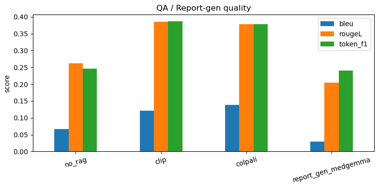
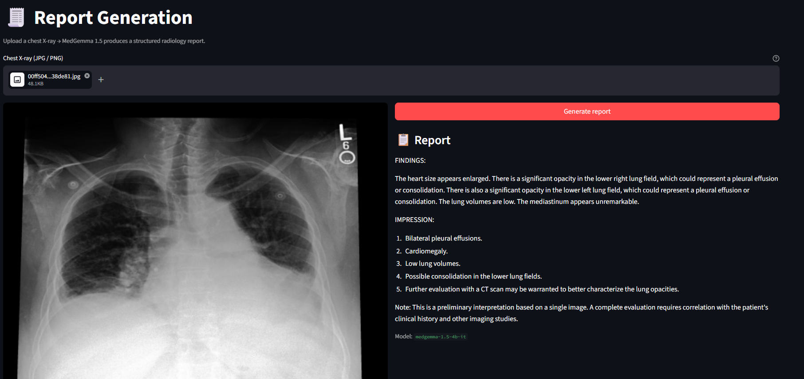
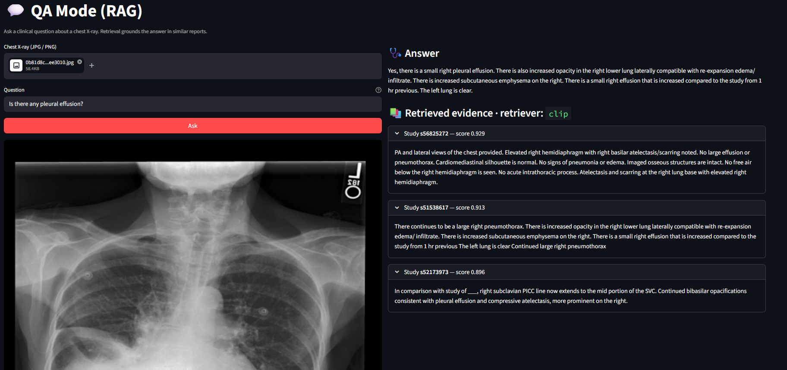

# Chest X-Ray Intelligence System (DSAI 413 — Assignment 2)

Dual-mode multi-modal system on MIMIC-CXR:

- **Report Generation** — chest X-ray → structured radiology report (MedGemma 4B).
- **QA Mode** — clinical question + X-ray → retrieved similar reports (ColPali or CLIP) → grounded answer (MedGemma 4B).

## Repo layout

```
api/           FastAPI backend (/report, /qa, /health)
frontend/      Streamlit UI (Report Generation, QA Mode)
rag/           Index builder + top-k retriever
src/
  config.py    Paths and model IDs
  data/        MIMIC-CXR loader, synthetic QA generator
  models/      MedGemma, ColPali, CLIP wrappers
evaluation/    BLEU / ROUGE-L / token-F1 / Recall@k
notebooks/
  01_data_exploration.ipynb   optional: visualize X-rays + report stats
  02_synthetic_qa_gen.ipynb   QA dataset generation
  03_model_testing.ipynb      build indexes + run model comparison
```

## Setup

```bash
pip install -r requirements.txt
# extras: colpali-engine, open_clip_torch, pyarrow
```

Download the MIMIC-CXR subset from Kaggle — [MIMIC-CXR dataset on Kaggle](https://www.kaggle.com/datasets/simhadrisadaram/mimic-cxr-dataset?authuser=0) — and place `archive.zip` in `data/`.

## Pipeline

```bash
# 1. Prepare mini dataset + extract JPGs (2000 by default; edit TARGET_N in loader.py)
python -m src.data.loader

# 2. Generate synthetic QA pairs (done on Kaggle — see notebooks/02_synthetic_qa_gen.ipynb)
python -m src.data.qa_generator

# 3. Build retrieval indexes
python -m rag.build_indexes              # both backends
# or: python -m rag.build_indexes --only clip
# or: python -m rag.build_indexes --only colpali

# 4. Run evaluation (saves to results/)
python -m evaluation.run_eval --qa 50 --rg 20

# 5. Backend
uvicorn api.main:app --reload

# 6. UI (new terminal)
streamlit run frontend/app.py
```

## Hardware note

Designed for an **RTX 4060 (8 GB VRAM)**. MedGemma runs in 4-bit (bitsandbytes); ColPali in bfloat16. Only a 2000-row mini sample is used; the full MIMIC-CXR is too large for this hardware. Synthetic QA generation is offloaded to a Kaggle GPU notebook (T4 16 GB) — see [notebooks/02_synthetic_qa_gen.ipynb](notebooks/02_synthetic_qa_gen.ipynb).

## Results

Eval on 50 random QA pairs and 20 random reports (run with `python -m evaluation.run_eval`). Saved tables in [results/](results/).

| Mode | BLEU-4 | ROUGE-L | Token-F1 | Recall@3 |
|---|---:|---:|---:|---:|
| MedGemma (no RAG) | 0.067 | 0.262 | 0.246 | — |
| MedGemma + BiomedCLIP RAG | 0.122 | **0.386** | **0.387** | 1.00 |
| MedGemma + ColPali RAG | **0.139** | 0.378 | 0.379 | 1.00 |
| MedGemma report generation | 0.029 | 0.205 | 0.241 | — |



**Key findings:**
- **RAG ~2× the answer quality.** BLEU climbs from 0.067 → 0.13 and Token-F1 from 0.25 → 0.39 when MedGemma is grounded by retrieved reports.
- **ColPali and BiomedCLIP are essentially tied.** ColPali wins BLEU (tighter phrasing overlap from multi-vector matching); BiomedCLIP wins Token-F1 (more medical-term coverage from biomedical pretraining). ROUGE-L is a wash. Choose by infrastructure cost: ColPali stores ~5× more per image.
- **Recall@3 = 1.00 is uninformative** — eval queries are corpus members, so the retriever trivially finds the gold study. The downstream BLEU / ROUGE / F1 gap is the true retrieval-quality signal.
- **Report-gen BLEU is low (0.029) but quality is high** — the prompt asks for *specific* findings (tubes, sides, lobes) rather than the safe "no acute cardiopulmonary process" template, so outputs diverge from any single gold reference. Inspect [results/report_predictions.csv](results/report_predictions.csv) to see the specificity.

## Screenshots

### Report Generation


### QA Mode with retrieved evidence


## Models compared

| Model | Role | Notes |
|---|---|---|
| MedGemma-4B-it | Report generation + QA generator | Mandatory. 4-bit. |
| ColPali v1.2 (merged) | Multi-vector image retrieval (late interaction) | Mandatory. Uses `vidore/colpali-v1.2-merged` (LoRA pre-merged into base weights) — avoids a key-naming mismatch with newer transformers when loading the un-merged variant. Zero-shot. |
| BiomedCLIP | Baseline single-vector retrieval | Suggested. Comparison baseline. |

Comparison metrics (notebook 03): **BLEU-4, ROUGE-L, token-F1** for report/QA quality; **Recall@3** for retrieval.

## Synthetic QA dataset

Built by prompting MedGemma with each report text and asking for three JSON QA pairs covering **presence**, **location**, and **severity**. The model is text-conditioned on the report (the image isn't used for QA generation because the ground truth comes from the report). See [src/data/qa_generator.py](src/data/qa_generator.py).
